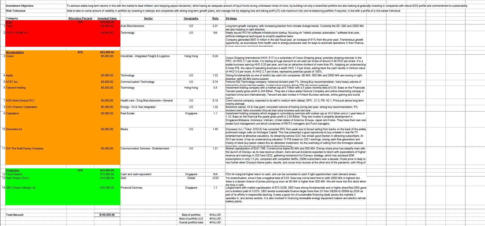
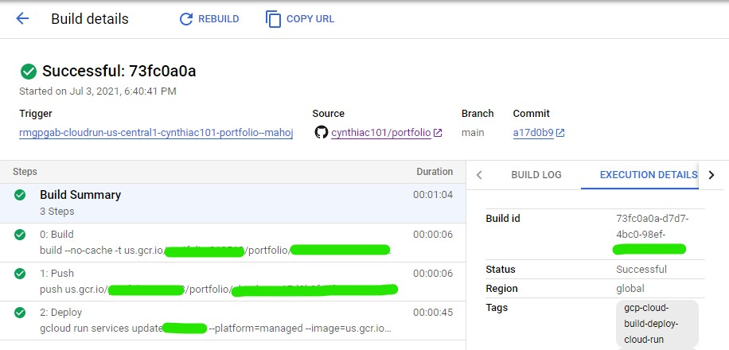

# [Diversified Portfolio Watchlist](https://github.com/cynthiac101/portfolio/blob/main/README.md)
I created this webpage following the module completion of **Fundamentals of Investing** where I learnt to leverage on fundamental and technical analysis for investing and the importance of building a diversified investment portfolio based on our risk appetite.

---
### CI/CD pipeline implemented using Google Cloud Platform Cloud Run API with [Github repository](https://github.com/cynthiac101/portfolio/) commits as workflow trigger:

  ### Create a build trigger
  Use Github repository commit event to start trigger.
  ### Build
  Build the container image
  ### Push
  Push the container image to Container Registry
  ### Deploy
  Deploy container image to Cloud Run

---
### Here is the stock watchlist based on my diversified investment portfolio with real-time market trading data via IEX API. This webpage will be updated from time to time as I review and make changes to my investment portfolio.   

Live endpoint available at URL: https://cloudrun-ejjumri6bq-uc.a.run.app
